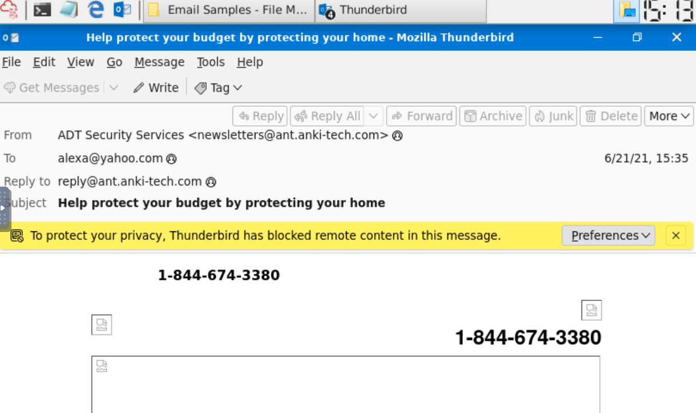
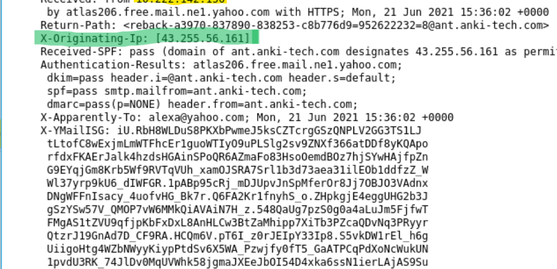
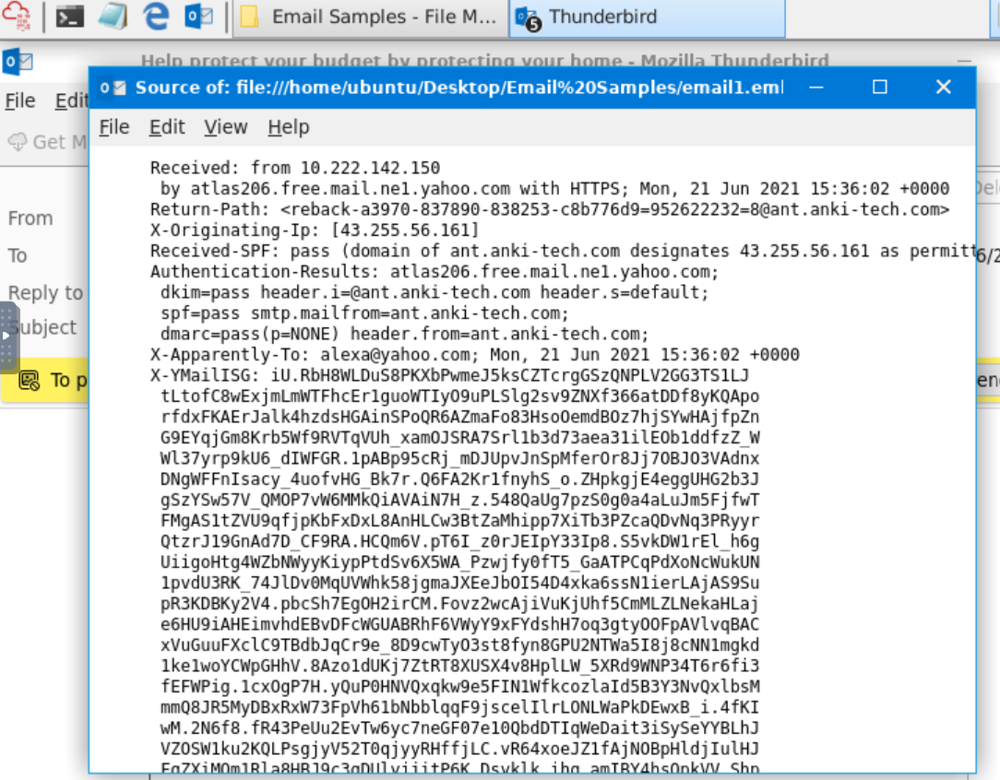
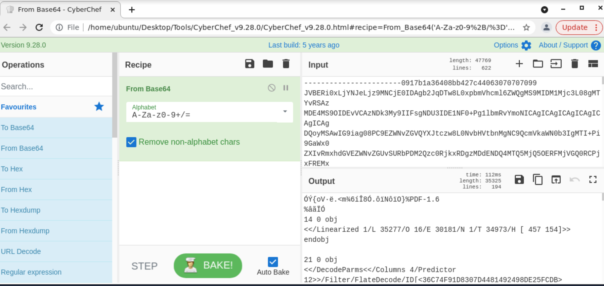
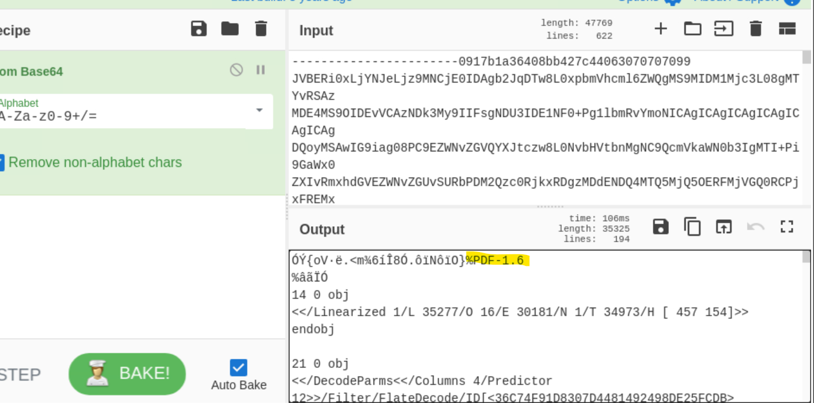

# Screenshots - Phishing Analysis Fundamentals

This folder contains screenshots from my Phishing Analysis Fundamentals investigation.

##  Investigation Screenshots

### Screenshot 1: Raw Email Headers

*Complete raw email headers showing sender, recipient, and routing information*

### Screenshot 2: Originating IP

*X-Originating-IP identified in the raw email source*

### Screenshot 3: Raw Message Source

*Full raw message source showing email headers and body*

### Screenshot 4: CyberChef Decoding

*CyberChef used to decode Base64 encoded PDF attachment*

### Screenshot 5: Decoded PDF

*Decoded PDF structure confirmed with %PDF-1.6 header*

---

##  Tools Used
- TryHackMe AttackBox
- Thunderbird (Email Client)
- CyberChef (Decoding)

##  Analysis Summary
- **Email Type:** Phishing (credential harvesting)
- **Attachment Found:** `zmqpalgh.pdf` (Base64 encoded)
- **PDF Header:** `%PDF-1.6`
- **PDF ID:** `<36C74F91D8307D4481492498DE25FCDB>`

---
*Screenshots from TryHackMe Phishing Analysis Fundamentals lab*
*Investigator: Michael Chris*
